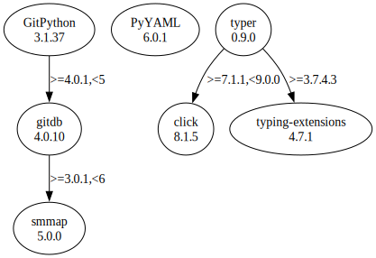

# Third Party Dependencies

<!--[[[fill sbom_sha256()]]]-->
The [SBOM in CycloneDX v1.4 JSON format](https://git.sr.ht/~sthagen/uuttaminen/blob/default/etc/sbom/cdx.json) with SHA256 checksum ([e0a808f5 ...](https://git.sr.ht/~sthagen/uuttaminen/blob/default/etc/sbom/cdx.json.sha256 "sha256:e0a808f54bbd3a3999bbf3e0778f7e718f98ece3066b5c343e9385413e69cd57")).
<!--[[[end]]] (checksum: eb47b6b4fd7dd0f2b32dbede8216fb23)-->
## Licenses 

JSON files with complete license info of: [direct dependencies](direct-dependency-licenses.json) | [all dependencies](all-dependency-licenses.json)

### Direct Dependencies

<!--[[[fill direct_dependencies_table()]]]-->
| Name                                                           | Version                                              | License     | Author                         | Description (from packaging data)                                    |
|:---------------------------------------------------------------|:-----------------------------------------------------|:------------|:-------------------------------|:---------------------------------------------------------------------|
| [GitPython](https://github.com/gitpython-developers/GitPython) | [3.1.37](https://pypi.org/project/GitPython/3.1.37/) | BSD License | Sebastian Thiel, Michael Trier | GitPython is a Python library used to interact with Git repositories |
| [PyYAML](https://pyyaml.org/)                                  | [6.0.1](https://pypi.org/project/PyYAML/6.0.1/)      | MIT License | Kirill Simonov                 | YAML parser and emitter for Python                                   |
| [typer](https://github.com/tiangolo/typer)                     | [0.9.0](https://pypi.org/project/typer/0.9.0/)       | MIT License | Sebastián Ramírez              | Typer, build great CLIs. Easy to code. Based on Python type hints.   |
<!--[[[end]]] (checksum: fa2e6dd25d8ed7e478c6b7aea631800d)-->

### Indirect Dependencies

<!--[[[fill indirect_dependencies_table()]]]-->
| Name                                                             | Version                                                    | License                            | Author                                                                                | Description (from packaging data)                                   |
|:-----------------------------------------------------------------|:-----------------------------------------------------------|:-----------------------------------|:--------------------------------------------------------------------------------------|:--------------------------------------------------------------------|
| [click](https://palletsprojects.com/p/click/)                    | [8.1.5](https://pypi.org/project/click/8.1.5/)             | BSD License                        | Pallets <contact@palletsprojects.com>                                                 | Composable command line interface toolkit                           |
| [gitdb](https://github.com/gitpython-developers/gitdb)           | [4.0.10](https://pypi.org/project/gitdb/4.0.10/)           | BSD License                        | Sebastian Thiel                                                                       | Git Object Database                                                 |
| [smmap](https://github.com/gitpython-developers/smmap)           | [5.0.0](https://pypi.org/project/smmap/5.0.0/)             | BSD License                        | Sebastian Thiel                                                                       | A pure Python implementation of a sliding window memory map manager |
| [typing_extensions](https://github.com/python/typing_extensions) | [4.7.1](https://pypi.org/project/typing_extensions/4.7.1/) | Python Software Foundation License | "Guido van Rossum, Jukka Lehtosalo, Łukasz Langa, Michael Lee" <levkivskyi@gmail.com> | Backported and Experimental Type Hints for Python 3.7+              |
<!--[[[end]]] (checksum: 649d9fc79a6ce5cc68349e321acfb610)-->

## Dependency Tree(s)

JSON file with the complete package dependency tree info of: [the full dependency tree](package-dependency-tree.json)

### Rendered SVG

Base graphviz file in dot format: [Trees of the direct dependencies](package-dependency-tree.dot.txt)



### Console Representation

<!--[[[fill dependency_tree_console_text()]]]-->
````console
GitPython==3.1.37
└── gitdb [required: >=4.0.1,<5, installed: 4.0.10]
    └── smmap [required: >=3.0.1,<6, installed: 5.0.0]
PyYAML==6.0.1
typer==0.9.0
├── click [required: >=7.1.1,<9.0.0, installed: 8.1.5]
└── typing-extensions [required: >=3.7.4.3, installed: 4.7.1]
````
<!--[[[end]]] (checksum: 4a8e53f455fd78dde46b7eeb5b96ec8e)-->
